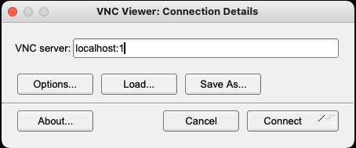
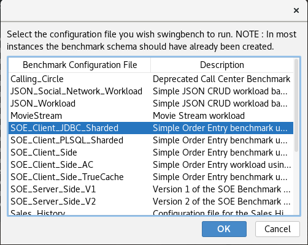
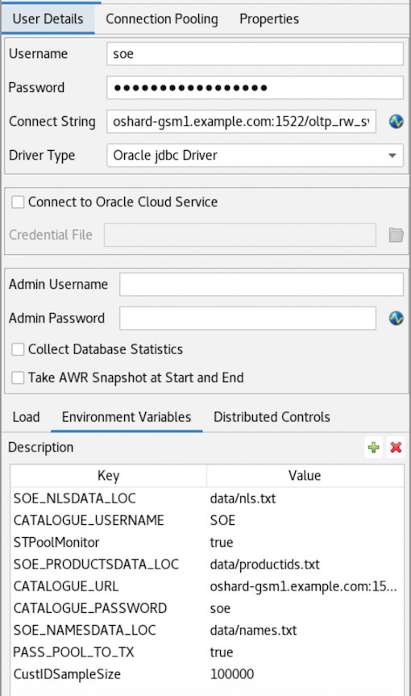
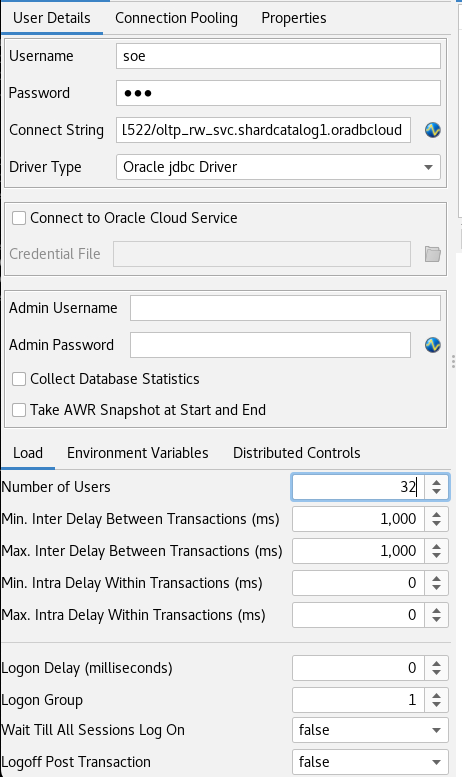
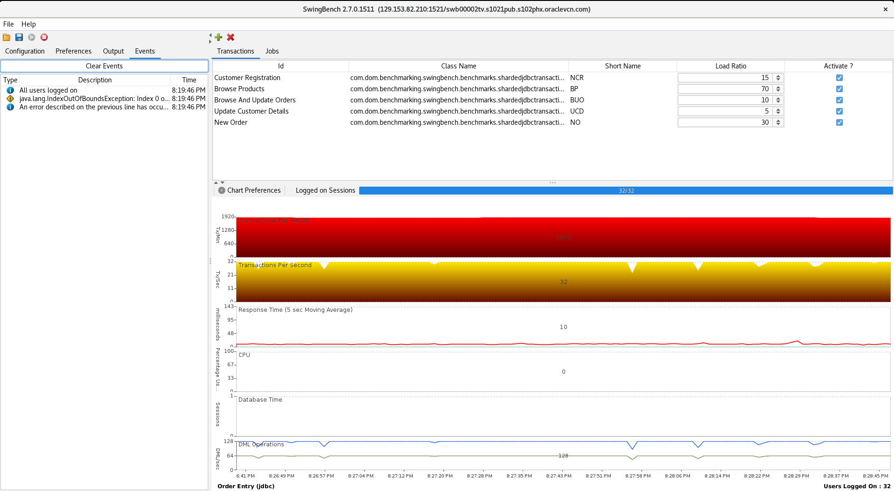

# Workload Testcase
After deploying an Oracle Globally Distributed Database with `System-Managed Sharding Topology with Raft Replication` using `podman-compose`, you can use this page for a workload test using [Swingbench](https://www.dominicgiles.com/swingbench/). 

The setup for this test uses Swingbench version 2.7

The workload will be tested using Swingbench from the Podman Host Machine on which the Oracle Globally Distributed Database is deployed using `podman-compose`.

**IMPORTANT:** This example used Oracle Database 23ai FREE RDBMS and GSM Container Images from Oracle Container Registry while deploying the Oracle Globally Distributed database using `podman-compose`.

- [Step 1: Setup the environment for test](#setup-the-environment-for-test)
  - [Step 1a: Prerequisites](#prerequisites)
  - [Step 1b: Download the software](#download-the-software)
  - [Step 1c: Unzip the software binaries](#unzip-the-software-binaries)
  - [Step 1d: Make Host entries](#make-host-entries)
- [Step 3: Schema Creation for the Swingbench Test](#schema-creation-for-the-swingbench-test)
 - [Step 3a: Create SOE Schema](#create-soe-schema)
 - [Step 3b: Create SOE Schema Objects](#create-soe-schema-objects)
- [Step 4: Start VNC Session](#start-vnc-session)
- [Step 5: Start the Workload](#start-the-workload)
- [Step 6: Monitor the Workload](#monitor-the-workload)
- [Copyright](#copyright)


## Setup the environment for test
### Prerequisites

The Podman Host Machine in this case is having Oracle Linux 8 OS.

- Install Xorg Packages for GUI display
```bash
dnf config-manager --enable ol8_codeready_builder* && \
dnf install xorg-x11-apps xauth && \
dnf clean all
```

- Create required directories and setup environment variables
```bash
mkdir -p /workload
mkdir -p /stage
chown -R oracle:oinstall /workload
chown -R oracle:oinstall /stage
```

### Download the software

Login as "oracle" user and downlaod the following software files:
- Swingbench 2.7: swingbenchlatest.zip
- jdk-17.0.6.tar.gz file

### Unzip the software

- Login as "oracle" user and unzip the software files:
```bash
unzip -q swingbenchlatest.zip -d /workload
tar -xzf jdk-17.0.6.tar.gz -C /stage
```

- Complete below steps as "oracle" user:
```bash
echo "export JAVA_HOME=/stage/jdk-17.0.6" >> /home/oracle/.bashrc
echo "PATH=\$JAVA_HOME/bin:\$PATH" >> /home/oracle/.bashrc
echo "export JAVA_HOME" >> /home/oracle/.bashrc
echo "export PATH" >> /home/oracle/.bashrc
```

### Make Host entries

On the Podman Host Machines, as "root" user, add below entries in the /etc/hosts for the IPs of the containers:
```bash
# cat /etc/hosts
127.0.0.1   localhost localhost.localdomain localhost4 localhost4.localdomain4
::1         localhost localhost.localdomain localhost6 localhost6.localdomain6
10.0.1.11 shard-tde-test.k8testpubvcn.k8test.oraclevcn.com shard-tde-test
10.0.20.100     oshard-gsm1.example.com         oshard-gsm1
10.0.20.102     oshard-catalog-0.example.com    oshard-catalog-0
10.0.20.103     oshard1-0.example.com           oshard1-0
10.0.20.104     oshard2-0.example.com           oshard2-0
10.0.20.105     oshard3-0.example.com           oshard3-0
10.0.20.106     oshard4-0.example.com           oshard4-0
10.0.20.101     oshard-gsm2.example.com         oshard-gsm2
```

## Schema Creation for the Swingbench Test

### Create SOE Schema
Follow the below steps to create the schema for the Swingbench test:

- Copy the SQL files from the `/workload/swingbench/sql/shardedorderentry` directory to the Catalog container:
```bash
podman cp /workload/swingbench/sql/shardedorderentry catalog:/home/oracle
```

- Switch to the Catalog Database Podman Container and switch to the directory `/home/oracle/shardedorderentry`:
```bash
# podman exec -it catalog /bin/bash
bash-4.4$
bash-4.4$ cd shardedorderentry
```

- Use `SQLPLUS` from ORACLE HOME to login with `SYSDBA` privileges to the `CAT1PDB` PDB:
```bash
$ORACLE_HOME/bin/sqlplus sys/<password>@//"oshard-catalog-0.example.com:1521/CAT1PDB" as sysdba
```

- Run the SQL file `sharded_create_user.sql` from SQL Prompt to create `SOE` user:
```bash
@sharded_create_user.sql
```

- Before running the next commands, confirm the status of the DDL Propagation from the GSM1:

Switch to the `gsm1` container:
```bash
podman exec -it gsm1 /bin/bash
```

Run the "show ddl" command to check the status of the DDL Propagation:
```bash
gdsctl show ddl -count 50
```

- Wait for few minutes DDL Propagation. The propagation for DDL ""CREATE TABLESPACE SET SOE_TS_SET" may take some time.
- Confirm the completion of command "CREATE TABLESPACE SET SOE_TS_SET using template" in the alert logs of Catalog and the Shard databases.
- Wait for few more minutes for completion for DDL commands executed after that.

### Create SOE Schema Objects
- Switch to the Catalog Database Podman Container and switch to the directory `/home/oracle/shardedorderentry`
- Use `SQLPLUS` from ORACLE HOME to login with `SOE` user to the `CAT1PDB` PDB:
```bash
$ORACLE_HOME/bin/sqlplus soe/soe@//"oshard-catalog-0.example.com:1521/CAT1PDB"
```

- Create the schema objects using below SQL scripts as "SOE" user:
```bash
@sharded_install.sql
@sharded_post_install.sql
```

## Start VNC Session

- Start a VNC session as `oracle` user from the Host Machine:
```bash
# vncserver
```

- Create an ssh port forwarding tunnel from local host to the Podman Host Machine:
```bash
$ ssh -L 5901:localhost:5901 opc@<Public IP of the Podman Host Machine>
```

- Start a VNC Client session and connect to "localhost:1"



- Accept the default settings
- On the Desktop, select Activities/Terminal
- Launch the Swingbench GUI using: `/workload/swingbench/bin/swingbench`
- Select the below option:



- Use the below values for the connect string and driver:
```bash
Connect String: oshard-gsm1.example.com:1522/oltp_rw_svc.shardcatalog1.oradbcloud
Driver Type: Oracle jdbc Driver
```

- Use below values for the Environment Variables:
```bash
SOE_NLSDATA_LOC: data/nls.txt
CATALOGUE_USERNAME: SOE
STPoolMonitor: true
SOE_PRODUCTSDATA_LOC: data/productids.txt
CATALOGUE_URL: oshard-gsm1.example.com:1522/GDS$CATALOG.oradbcloud
CATALOGUE_PASSWORD: soe
SOE_NAMESDATA_LOC: data/names.txt
PASS_POOL_TO_TX: true
```




## Start the Workload

Run a Workload required number of users. In current case, `32` users were used for the workload:



### Monitor the Workload

Now, you can monitor the workload on the Swingbench Screen now !!



## Copyright

Copyright (c) 2022 - 2024 Oracle and/or its affiliates.
Released under the Universal Permissive License v1.0 as shown at https://oss.oracle.com/licenses/upl/